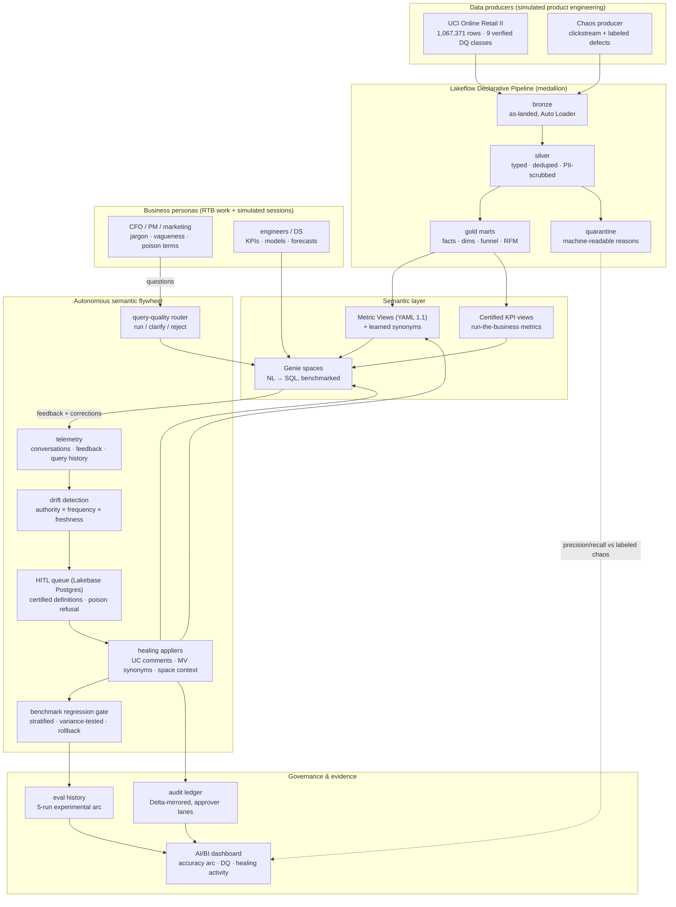

# Genie Autopilot — Autonomous Context Engine

Autonomous Context Engine: an autonomous learning system that treats user interaction
with Genie as a real-time telemetry stream. By mining feedback and query logs, the
system dynamically hydrates Metric Views, Unity Catalog metadata, and Genie space
context — converting raw human behavior into automated metadata & governance actions.

**The measured result** (live stratified benchmark, 5 eval runs, evidence in
[docs/eval-evidence.md](docs/eval-evidence.md)):

| healing stage | bleeding-edge dialect | clean control | aggregate |
|---|---|---|---|
| naive baseline | 40% | 75% | 56% |
| synonym-only healing | 40% **(+0 — the key finding)** | 75% | 56% |
| HITL-certified definitions | 80% | **100%** | 89% |
| + collision aliases & poison-term handling | **80% mean, 70–90% range** (repeated runs) | 100% (stable) | up to **95%** |

Genie is nondeterministic, so the healed state was re-evaluated 3× : clean and
collision strata are perfectly stable at 100%; jargon averages 80% (doubled from
baseline) with run-to-run breathing room honestly reported as a range.

Why synonyms alone do nothing: [docs/semantic-failure-taxonomy.md](docs/semantic-failure-taxonomy.md).
Poison terms ('sales' = revenue to finance, units to merchandising) are detected as
contradictory corrections and healed as disambiguation instructions — never synonyms.
DQ layer vs producer's labeled chaos: PII 100%/100%, bots 100%/100%, dupes 68/68,
malformed 14/14 (precision/recall against ground truth, not vibes).

```
user friction (thumbs-down + corrections)
   → telemetry ingest (Conversation API / system tables)
   → drift detection (deterministic parser + ai_query, scored by authority·frequency·freshness)
   → governed healing gate (auto-approve threshold, human queue, audit ledger)
   → three appliers: UC comments/tags · Metric View YAML synonyms · Genie serialized_space
   → benchmark regression gate (eval-run API) with automatic rollback
```

## End-to-end architecture



Full design: [docs/architecture-v2.md](docs/architecture-v2.md) ·
Failure taxonomy: [docs/semantic-failure-taxonomy.md](docs/semantic-failure-taxonomy.md) ·
RTB scenarios: [docs/rtb-scenarios.md](docs/rtb-scenarios.md) ·
Tour: [docs/workspace-tour.md](docs/workspace-tour.md) ·
Pitch: [docs/interview-pitch.md](docs/interview-pitch.md) ·
Admin playbook: [docs/admin-governance.md](docs/admin-governance.md) ·
FE-limits backlog: [docs/backlog-free-edition-limits.md](docs/backlog-free-edition-limits.md) ·
Study track: [docs/study-plan.md](docs/study-plan.md)

## Scenario

Cross-BU Retail Banking & Compliance (synthetic data, seeded RNG, zero real PII):
a wealth advisor's *"liquid assets"* (`fact_wealth_portfolios.liquid_cash_assets`) and a
branch manager's *"available balance"* (`fact_transactions.available_balance`) collide.
Genie starts with deliberately sparse metadata, fails the jargon questions, and earns
its improved semantic layer from user friction alone.

## Quickstart

```bash
make install          # venv + package
make test lint        # pure-python units (parser, scorer, YAML regen, gate)
make datagen          # deterministic synthetic banking data → data_gen/output/inserts.sql

# Workspace targets need a Databricks Free Edition PAT in the macOS Keychain:
#   security add-generic-password -s databricks-fe -a <you> -w <token>
make bootstrap        # schema + data + metric views + Genie space
make eval             # baseline benchmark scorecard
make simulate         # persona fleet drives REAL Genie traffic + feedback (paced ≤5 q/min)
make detect           # scored drift proposals from harvested telemetry
make heal             # governed application + audit ledger
make eval             # post-healing scorecard → the before/after
```

Runs entirely on [Databricks Free Edition](https://docs.databricks.com/aws/en/getting-started/free-edition)
(serverless-only, PAT auth). Built with Metric Views (YAML spec 1.1), the Genie
Conversation & Space Management APIs (GA 2026), Genie Benchmarks eval runs, AI
Functions on serverless SQL, and Databricks Asset Bundles.

## v2: the data-organization simulation

The flywheel's training signal now comes from a simulated data org
([docs/architecture-v2.md](docs/architecture-v2.md)): a product-engineering **producer**
emitting clickstream with labeled chaos against the real
[UCI Online Retail II](https://archive.ics.uci.edu/dataset/502/online+retail+ii) catalog
(1,067,371 rows, 9 verified DQ issue classes), a **medallion pipeline** (Lakeflow
Declarative Pipelines: Auto Loader bronze → quarantine-split silver → dimensional gold),
a **data-science persona** (KPIs, `AI_FORECAST`, MLflow propensity model), and
**PM/marketing fleets** asking realistically noisy questions at a real Genie space —
filtered by a predictive query-quality model, clustered by unsupervised drift detection,
and routed to a **Lakebase**-backed human-in-the-loop queue when confidence is low.

## Status

- [x] Banking flywheel v1: schema, metric views, Genie space via API, live conversation smoke test
- [x] Package: paced Genie client, drift scorer, governed healing, eval runner, producer (16+ tests)
- [x] Retail medallion: UCI ingest to volume, bronze/silver/gold + quarantine, clickstream layer
- [x] CI green (ruff + pytest on every push)
- [ ] Phase C: retail Genie space + benchmark suite loaded via API, baseline score
- [ ] Phase D: persona fleets → telemetry → drift → Lakebase HITL → healing → post-heal score
- [ ] Phase E: learning loops trained on labeled outcomes; DQ precision/recall vs ground truth
- [ ] Phase F: health dashboard, before/after scorecard, demo recording

---

*Personal educational project on Databricks Free Edition. Synthetic data only.
Not affiliated with or endorsed by Databricks.*
