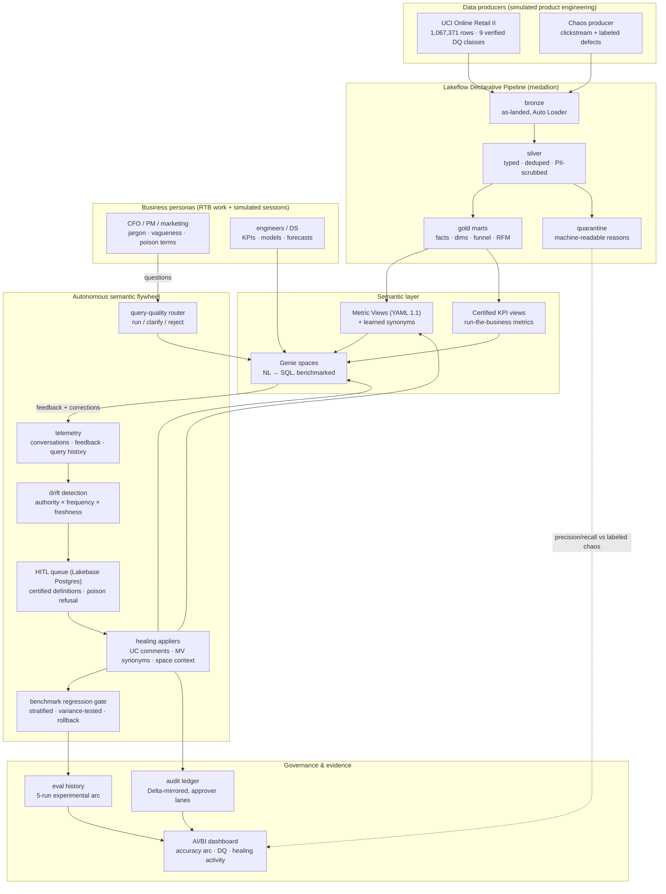

# Genie Autopilot — Autonomous Context Engine

Business users don't know your schemas — they say GMV, whales, take rate, bounce, and
assume the system "automagically" knows what they mean. They deserve answers in their
own language. This project is an autonomous learning system that treats user
interaction with Genie as a real-time telemetry stream: by mining feedback and query
logs, it dynamically hydrates Metric Views, Unity Catalog metadata, and Genie space
context — converting raw human friction into governed metadata actions, so the
warehouse learns the users' language instead of the reverse. Safely: every learned
definition is benchmark-gated, audit-logged, rollback-protected, and the decisions
machines must not make alone (poison terms, disclosure rules, new metrics) are
escalated to a human steward — while no user session ever blocks.

## The measured result

**Arc 1 — the original 18-question stratified suite** (live benchmark, 5 eval runs,
evidence in [docs/eval-evidence.md](docs/eval-evidence.md)):

| healing stage | bleeding-edge dialect | clean control | aggregate |
|---|---|---|---|
| naive baseline | 40% | 75% | 56% |
| synonym-only healing | 40% **(+0 — the key finding)** | 75% | 56% |
| HITL-certified definitions | 80% | **100%** | 89% |
| + collision aliases & poison-term handling | **80% mean, 70–90% range** (repeated runs) | 100% (stable) | up to **95%** |

Genie is nondeterministic, so the healed state was re-evaluated 3×: clean and
collision strata are perfectly stable at 100%; jargon averages 80% (doubled from
baseline) with run-to-run breathing room honestly reported as a range.

**Arc 2 — replication at ~4× scale** (66 → 70 human-certified questions, steward
certification session + healing; runs `01f17bd7…` → `01f17be5…`):

| stage | jargon | collision | clean control | aggregate |
|---|---|---|---|---|
| certified-suite baseline (66 q) | 14/25 = 56% | 7/11 = 64% | 22/30 = 73% | 43/66 = **65%** |
| post-certification healing (70 q) | 22/28 = **79%** | 7/12 = 58% | 22/30 = 73% **(flat — no regression)** | 51/70 = **73%** |

The headline replicates on a bigger, human-certified suite: **jargon 56% → 79% with a
flat clean control**. The collision row is reported as-is — same 7 correct while the
stratum itself grew by one question during certification.

Why synonyms alone do nothing: [docs/semantic-failure-taxonomy.md](docs/semantic-failure-taxonomy.md).
Poison terms ('sales' = revenue to finance, units to merchandising) are detected as
contradictory corrections and healed as disambiguation instructions — never synonyms.
DQ layer vs producer's labeled chaos: PII 100%/100%, bots 100%/100%, dupes 68/68,
malformed 14/14 (precision/recall against ground truth, not vibes).

## Why this matters

- **Evidence over demos.** A variance protocol (3× repeated evals, mean ± range), a
  replication of the headline result at ~4× benchmark scale, and a published negative
  result (synonym-only healing measured exactly +0%) — the numbers are built to
  survive skepticism, not to look good once.
- **Governance as a feature.** A Lakebase-backed HITL queue, a decide ≠ deploy
  boundary (steward decisions are applied only through the same gated appliers as
  everything else), an append-only audit ledger with approver lanes, and a
  *performed* rollback drill: a poisoned definition tripped the benchmark gate, the
  snapshot was restored, recovery verified ([docs/eval-evidence.md](docs/eval-evidence.md)).
- **Roadmap alignment.** Genie Ontology (Public Preview) points at authority-ranked,
  usage-refreshed semantic context; this repo is the public-API embodiment of that
  same conviction — an Ontology on-ramp with evidence, not a competitor
  ([docs/architecture-v2.md](docs/architecture-v2.md), [docs/roadmap-v3.md](docs/roadmap-v3.md)).

## How it works

```
user friction (thumbs-down + corrections)
   → telemetry ingest (Conversation API / system tables)
   → drift detection (deterministic parser + ai_query, scored by authority·frequency·freshness)
   → governed healing gate (auto-approve threshold, human queue, audit ledger)
   → three appliers: UC comments/tags · Metric View YAML synonyms · Genie serialized_space
   → benchmark regression gate (eval-run API) with automatic rollback
```



| Layer | Components | Where |
|---|---|---|
| Data producers | UCI converter · chaos producer (labeled defects) · banking datagen | [data_gen/](data_gen/README.md), [src/genie_autopilot/producer.py](src/genie_autopilot/producer.py) |
| Medallion pipeline | Auto Loader bronze → quarantine-split silver → dimensional gold (sales + clickstream) | [pipelines/](pipelines/README.md), [resources/retail_pipeline.yml](resources/retail_pipeline.yml) |
| Semantic layer | Metric views (YAML 1.1) · certified KPI views · Genie spaces via API | [sql/](sql/README.md) |
| Simulation (business personas) | banking/retail fleets · multi-turn session engine · calendar drift waves | [src/genie_autopilot/](src/genie_autopilot/README.md) |
| Learning + escalation | telemetry harvest · drift scoring · query-quality gate · steward engine · semantic router | [src/genie_autopilot/](src/genie_autopilot/README.md), [notebooks/](notebooks/README.md) (60/61) |
| Governed application + HITL | healing appliers · Lakebase HITL queue · audit ledger · steward console | [src/genie_autopilot/](src/genie_autopilot/README.md), [notebooks/](notebooks/README.md) (30/80) |
| Evaluation + evidence | stratified benchmark harness · phase drivers · certification CLI · eval log | [benchmarks/](benchmarks/README.md), [docs/eval-evidence.md](docs/eval-evidence.md) |
| Orchestration | Asset Bundle: flywheel, nightly sessions, router, daily-ops jobs | [databricks.yml](databricks.yml), [resources/autopilot_jobs.yml](resources/autopilot_jobs.yml) |

### The two scenarios

**v1 — Cross-BU Retail Banking & Compliance** (synthetic data, seeded RNG, zero real
PII): a wealth advisor's *"liquid assets"* (`fact_wealth_portfolios.liquid_cash_assets`)
and a branch manager's *"available balance"* (`fact_transactions.available_balance`)
collide. Genie starts with deliberately sparse metadata, fails the jargon questions,
and earns its improved semantic layer from user friction alone.

**v2 — the data-organization simulation** ([docs/architecture-v2.md](docs/architecture-v2.md)):
the flywheel's training signal comes from a simulated data org — a product-engineering
**producer** emitting clickstream with labeled chaos against the real
[UCI Online Retail II](https://archive.ics.uci.edu/dataset/502/online+retail+ii) catalog
(1,067,371 rows, 9 verified DQ issue classes), a **medallion pipeline** (Lakeflow
Declarative Pipelines: Auto Loader bronze → quarantine-split silver → dimensional gold),
a **data-science persona** (KPIs, `AI_FORECAST`, MLflow propensity model), and
**PM/marketing fleets** asking realistically noisy questions at a real Genie space —
filtered by a predictive query-quality model, clustered by unsupervised drift detection,
and routed to a **Lakebase**-backed human-in-the-loop queue when confidence is low.

## Quickstart

```bash
make install          # venv + package
make test lint        # pure-python units (parser, scorer, YAML regen, gate)
make datagen          # deterministic synthetic banking data → data_gen/output/inserts.sql

# Workspace targets need a Databricks Free Edition PAT in the macOS Keychain:
#   security add-generic-password -s databricks-fe -a <you> -w <token>
make bootstrap        # schema + data + metric views + Genie space
make eval             # baseline benchmark scorecard
make simulate         # persona fleet drives REAL Genie traffic + feedback (paced ≤5 q/min)
make detect           # scored drift proposals from harvested telemetry
make heal             # governed application + audit ledger
make eval             # post-healing scorecard → the before/after
```

### Reproducing the v2 retail arc from scratch

```bash
.venv/bin/python data_gen/convert_uci.py                  # UCI xlsx → raw CSVs (zero cleaning)
databricks bundle deploy -t dev --profile free-edition    # jobs + pipeline to the workspace
databricks bundle run retail_medallion -t dev             # bronze → silver/quarantine → gold
# create the retail Genie space, sync benchmarks, then:
GA_GENIE_SPACE_ID=<space> .venv/bin/python -m genie_autopilot.phase_d     # fleet → heal → lift
GA_GENIE_SPACE_ID=<space> .venv/bin/python -m genie_autopilot.phase_e     # collision + poison + DQ scorecard
GA_GENIE_SPACE_ID=<space> .venv/bin/python -m genie_autopilot.phase_f_variance --runs 3
GA_GENIE_SPACE_ID=<space> .venv/bin/python -m genie_autopilot.phase_g_rollback
make sessions certify                                     # corpus growth + human benchmark certification
```

Runs entirely on [Databricks Free Edition](https://docs.databricks.com/aws/en/getting-started/free-edition)
(serverless-only, PAT auth). Built with Metric Views (YAML spec 1.1), the Genie
Conversation & Space Management APIs (GA 2026), Genie Benchmarks eval runs, AI
Functions on serverless SQL, Lakebase, MLflow/UC model registry, and Databricks
Asset Bundles.

## Repo map

| Directory | What's inside |
|---|---|
| [src/genie_autopilot/](src/genie_autopilot/README.md) | The package: paced client, simulation, learning loops, governed healing, eval harness |
| [notebooks/](notebooks/README.md) | Workspace flywheel notebooks 10–90 and their job wiring |
| [pipelines/](pipelines/README.md) | The retail medallion (Lakeflow Declarative Pipeline) with quarantine-split DQ |
| [sql/](sql/README.md) | Schemas, metric views, certified KPI views, dashboard + admin queries — SQL as code |
| [benchmarks/](benchmarks/README.md) | Stratified golden-question suites: curated ground truth + certification workflow |
| [data_gen/](data_gen/README.md) | UCI dataset, banking datagen, labeled chaos output, session manifests |
| [tests/](tests/README.md) | Pure-python, zero-network unit suite (fakes over mocks) |
| [docs/](docs/README.md) | Full documentation index and reading path |
| [infra/](infra/README.md) | Infrastructure-as-code: workspace setup, RBAC roles, bootstrap |
| [resources/](resources/autopilot_jobs.yml) | Asset Bundle job + pipeline definitions |

More entry points: [tour](docs/workspace-tour.md) · [pitch](docs/interview-pitch.md) ·
[demo script](docs/demo-script.md) · [admin playbook](docs/admin-governance.md) ·
[RTB scenarios](docs/rtb-scenarios.md) · [study track](docs/study-plan.md)

## Status & roadmap

- [x] Banking flywheel v1: schema, metric views, Genie space via API, live conversation smoke test
- [x] Package: paced Genie client, drift scorer, governed healing, eval runner, producer (16+ tests)
- [x] Retail medallion: UCI ingest to volume, bronze/silver/gold + quarantine, clickstream layer
- [x] CI green (ruff + pytest on every push)
- [x] Phase C: retail Genie space + benchmark suite loaded via API, baseline score (56% aggregate)
- [x] Phase D: persona fleets → telemetry → drift → HITL → healing → post-heal score (jargon 40% → 80%)
- [x] Phase E: learning loops trained on labeled outcomes; DQ precision/recall vs ground truth
- [x] Hardening: 3× variance study · rollback drill performed · 70-question certified suite · semantic router + experimental arm · nightly session corpus
- [ ] Ongoing (v3 lanes, [docs/roadmap-v3.md](docs/roadmap-v3.md)): calendar drift waves land in the wild (from 2026-07-14), dashboard trend accumulation, router pass-through relaxation as the corpus grows

What Free Edition blocks and what we shipped instead:
[docs/backlog-free-edition-limits.md](docs/backlog-free-edition-limits.md).
Operations: [SECURITY.md](SECURITY.md) (credential posture) · [docs/runbook.md](docs/runbook.md) (incident playbooks + idempotency) · [infra/COVERAGE.md](infra/COVERAGE.md) (IaC audit: 59/67 objects re-creatable from this repo).

---

*Personal educational project on Databricks Free Edition. Synthetic data only.
Not affiliated with or endorsed by Databricks.*
